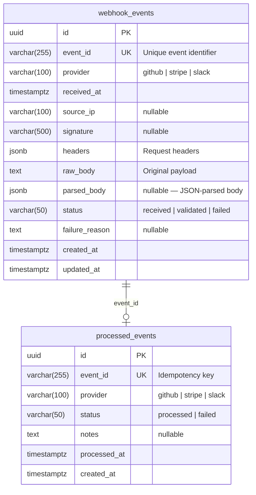

# Integration Platform

A webhook ingestion and processing platform built with NestJS. It receives webhooks from external providers (GitHub, Stripe, Slack), queues them via NATS JetStream, verifies signatures, and persists events into PostgreSQL.

## Architecture

```
                          POST /webhooks/:provider
┌──────────────┐          (accepts any payload)          ┌────────────────┐
│   External   │ ──────────────────────────────────────► │  API Gateway   │
│   Provider   │ ◄── 202 { eventId } ─────────────────── │  :3000         │
│ (GitHub,     │                                         └───────┬────────┘
│  Stripe,     │                                                 │
│  Slack)      │                                          publish │
└──────────────┘                                                 ▼
                                                        ┌────────────────┐
                              webhook.received.v1       │ NATS JetStream │
                         ┌───────────────────────────── │ :4222          │
                         │                              │ Stream:WEBHOOKS│
                         ▼                              └───────┬────────┘
                ┌────────────────┐                              │
                │    Webhook     │  1. Idempotency check        │ advisory
                │   Processor   │  2. Store event               │ (max_deliver)
                │  (no HTTP)    │  3. Verify signature          ▼
                │               │  4. Update status      ┌──────────────┐
                │               │  5. Publish validated  │  DLQ Stream  │
                │               │  6. Record processed   │  dlq.webhook │
                └───────┬───────┘                        └──────────────┘
                        │
                        │ TypeORM
                        ▼
                ┌────────────────┐
                │  PostgreSQL    │
                │  :5434         │
                │  integration_  │
                │  platform      │
                └────────────────┘
```

## Project Structure

```
integration-platform/
├── apps/
│   ├── api-gateway/                 # HTTP API — receives webhooks
│   │   └── src/
│   │       ├── main.ts
│   │       ├── app.module.ts
│   │       └── modules/webhook/
│   │           ├── controllers/     # POST /webhooks/:provider
│   │           ├── services/        # Publish to NATS
│   │           ├── dto/
│   │           ├── interfaces/
│   │           └── constants/       # Signature header mapping
│   │
│   ├── webhook-processor/           # NATS consumer — processes & persists
│   │   └── src/
│   │       ├── main.ts
│   │       ├── app.module.ts
│   │       ├── consumers/           # JetStream pull consumers
│   │       ├── services/            # Verification, idempotency, storage
│   │       ├── entities/            # TypeORM entities
│   │       ├── migrations/          # Database migrations
│   │       └── data-source.ts
│   │
│   └── integration-service/         # Downstream consumer (planned)
│       └── src/
│           ├── adapters/            # GitHub, Slack, Stripe adapters
│           ├── consumers/           # Event consumers per provider
│           ├── entities/
│           └── services/
│
├── libs/
│   ├── common/                      # Shared enums
│   │   └── enums/
│   ├── contracts/                   # Event schemas & NATS subjects
│   │   ├── subjects.ts
│   │   └── events/
│   └── messaging/                   # NATS JetStream utilities
│       ├── nats.module.ts
│       ├── jetstream.service.ts
│       ├── publisher.ts
│       └── consumer.factory.ts
│
├── infrastructure/
│   └── docker/
│       ├── docker-compose.yml
│       └── nats/nats-server.conf
│
├── docs/
│   └── openapi.yaml                 # OpenAPI 3.0 spec (importable to Apidog)
│
├── nest-cli.json
├── package.json
├── pnpm-workspace.yaml
└── tsconfig.json
```

## Tech Stack

| Layer | Technology |
|-------|-----------|
| Framework | NestJS 11 |
| Language | TypeScript 5 |
| Message Broker | NATS 2.11 with JetStream |
| Database | PostgreSQL 16 |
| ORM | TypeORM 0.3 |
| Runtime | Node.js |
| Package Manager | pnpm (workspace) |
| Containerization | Docker Compose |

## Prerequisites

- Node.js >= 20
- pnpm >= 9
- Docker & Docker Compose

## Getting Started

### 1. Install dependencies

```bash
pnpm install
```

### 2. Start infrastructure

```bash
docker compose -f infrastructure/docker/docker-compose.yml up -d
```

This starts:

| Service | Port | Purpose |
|---------|------|---------|
| NATS | 4222 (client), 8222 (monitoring) | Message broker with JetStream |
| PostgreSQL | 5434 | Database |

### 3. Run database migrations

```bash
pnpm build:webhook-processor
pnpm migration:run:webhook
```

### 4. Start the services

```bash
# Terminal 1 — API Gateway
pnpm start:api-gateway:dev

# Terminal 2 — Webhook Processor (build first, then run)
pnpm build:webhook-processor
node dist/apps/webhook-processor/main.js
```

### 5. Send a test webhook

```bash
curl -X POST http://localhost:3000/webhooks/github \
  -H "Content-Type: application/json" \
  -H "x-hub-signature-256: sha256=test" \
  -d '{"action":"opened","repository":{"name":"test-repo"}}'
```

Expected response:

```json
{
  "message": "Webhook accepted",
  "accepted": true,
  "eventId": "550e8400-e29b-41d4-a716-446655440000"
}
```

## API Reference

### `POST /webhooks/:provider`

Accepts a webhook from an external provider and queues it for asynchronous processing.

| Parameter | Location | Description |
|-----------|----------|-------------|
| `provider` | Path | `github`, `stripe`, or `slack` |
| Body | Request | Raw provider payload (any JSON) |

**Provider-specific signature headers:**

| Provider | Header |
|----------|--------|
| GitHub | `x-hub-signature-256` |
| Stripe | `stripe-signature` |
| Slack | `x-slack-signature` |

**Response:** `202 Accepted`

```json
{
  "message": "Webhook accepted",
  "accepted": true,
  "eventId": "<uuid>"
}
```

Full API documentation is available in `docs/openapi.yaml` — import it into [Apidog](https://apidog.com) or any OpenAPI-compatible tool.

## Database Schema



### `webhook_events`

Stores every received webhook with its full payload and processing status.

| Column | Type | Description |
|--------|------|-------------|
| `id` | uuid | Primary key |
| `event_id` | varchar(255) | Unique identifier assigned by the API Gateway |
| `provider` | varchar(100) | `github`, `stripe`, or `slack` |
| `received_at` | timestamptz | When the webhook was received |
| `source_ip` | varchar(100) | Client IP address |
| `signature` | varchar(500) | Provider signature header value |
| `headers` | jsonb | Full request headers |
| `raw_body` | text | Original request body |
| `parsed_body` | jsonb | JSON-parsed body (null if not valid JSON) |
| `status` | varchar(50) | `received` &rarr; `validated` or `failed` |
| `failure_reason` | text | Reason for failure (if status = `failed`) |
| `created_at` | timestamptz | Row creation time |
| `updated_at` | timestamptz | Last update time |

### `processed_events`

Idempotency table that prevents duplicate processing.

| Column | Type | Description |
|--------|------|-------------|
| `id` | uuid | Primary key |
| `event_id` | varchar(255) | Same as `webhook_events.event_id` |
| `provider` | varchar(100) | `github`, `stripe`, or `slack` |
| `status` | varchar(50) | `processed` or `failed` |
| `notes` | text | Additional context |
| `processed_at` | timestamptz | When processing completed |
| `created_at` | timestamptz | Row creation time |

## NATS Subjects & Streams

| Subject | Stream | Purpose |
|---------|--------|---------|
| `webhook.received.v1` | `WEBHOOKS` | API Gateway publishes incoming webhooks |
| `webhook.validated.v1` | `WEBHOOKS` | Processor publishes after signature verification |
| `dlq.webhook.v1` | `WEBHOOKS_DLQ` | Dead-letter queue for messages exceeding max delivery |
| `integration.command.v1` | — | Integration commands (planned) |

**Consumer configuration:**

| Setting | Value |
|---------|-------|
| Durable name | `webhook-processor-received-v1` |
| Ack wait | 30 seconds |
| Max deliveries | 5 |

## Processing Pipeline

1. **Receive** — API Gateway accepts the webhook, assigns an `eventId`, and publishes a `WebhookReceivedEvent` to NATS
2. **Idempotency check** — Processor checks `processed_events` to skip duplicates
3. **Store** — Webhook is saved to `webhook_events` with status `received`
4. **Signature verification** — HMAC-SHA256 for GitHub; Stripe and Slack are stub implementations
5. **Status update** — `webhook_events.status` is set to `validated` or `failed`
6. **Publish validated** — A `WebhookValidatedEvent` is published to `webhook.validated.v1`
7. **Record** — An entry is added to `processed_events` for idempotency
8. **DLQ** — If a message fails after 5 delivery attempts, it is moved to the dead-letter queue

## Scripts

| Script | Description |
|--------|-------------|
| `pnpm start:api-gateway` | Start API Gateway |
| `pnpm start:api-gateway:dev` | Start API Gateway in watch mode |
| `pnpm build:webhook-processor` | Build Webhook Processor |
| `pnpm migration:run:webhook` | Run TypeORM migrations |
| `pnpm lint` | Lint and auto-fix |
| `pnpm test` | Run unit tests |
| `pnpm test:e2e` | Run end-to-end tests |
| `pnpm format` | Format code with Prettier |

## Environment Variables

### API Gateway

| Variable | Default | Description |
|----------|---------|-------------|
| `PORT` | `3000` | HTTP server port |
| `NATS_SERVERS` | `nats://localhost:4222` | NATS connection URL |

### Webhook Processor

| Variable | Default | Description |
|----------|---------|-------------|
| `NATS_SERVERS` | `nats://localhost:4222` | NATS connection URL |
| `DB_HOST` | `localhost` | PostgreSQL host |
| `DB_PORT` | `5432` | PostgreSQL port |
| `DB_USER` | `postgres` | Database user |
| `DB_PASSWORD` | `postgres` | Database password |
| `DB_NAME` | `integration_platform` | Database name |
| `GITHUB_WEBHOOK_SECRET` | — | Secret for GitHub HMAC verification |

## License

UNLICENSED
